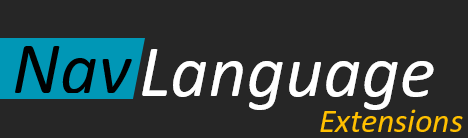

# Nav Language

Die Nav Language ist einerseits eine Sprache zur Beschreibung von Workflows im Sinne von UML Aktivitätsdiagrammen,
andererseits beinhaltet sie auch Sprachelemente, um das
Erzeugen von C# Code zu beeinflussen.

| Branch | Status |
|--------|---------|
|**master**||
|**develop**||
